# Image Warping

数字图像处理第一次作业：基于基本图像几何变换以及基于控制点来实现图像变形。

## Requirements

To install requirements:

```cmd
pip install -r requirements.txt
```

## Running

To run basic transformation, run:

```cmd
python run_global_transform.py
```

To run point guided transformation, run:

```cmd
python run_point_transform.py
```

## Results

### Basic Transformation

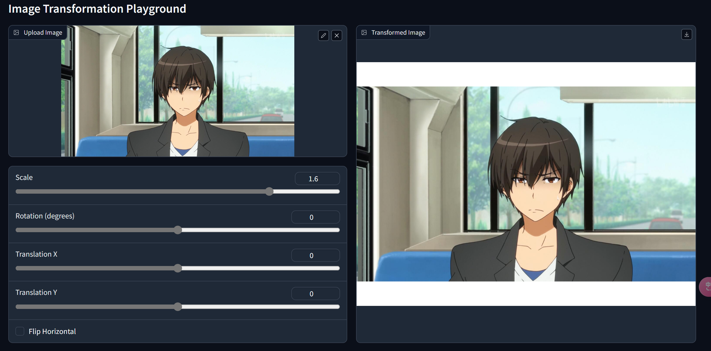

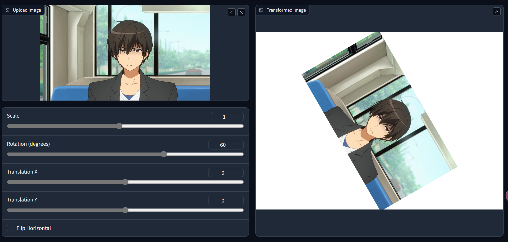

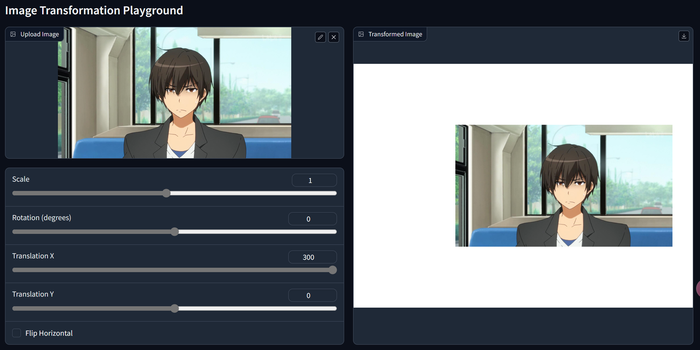

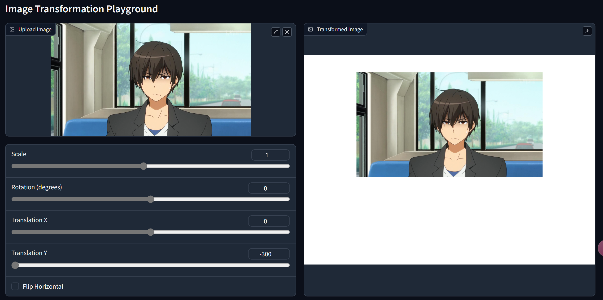

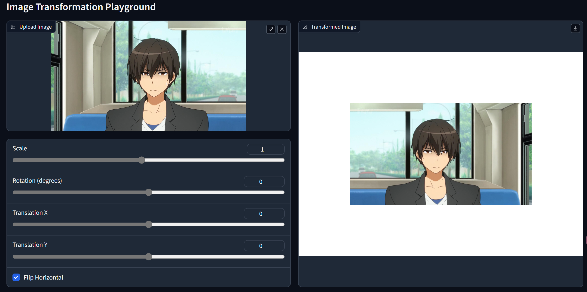


### Point Guided Deformation(RBF):

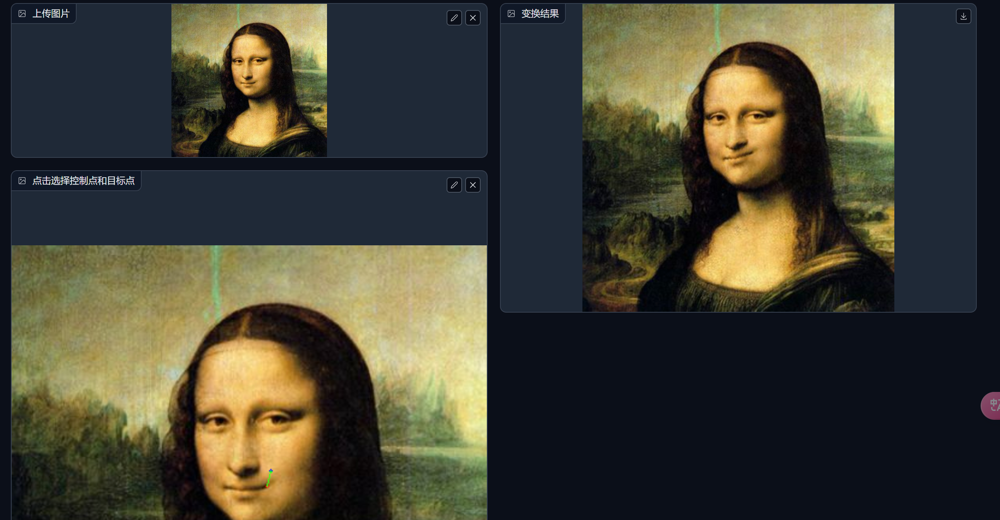

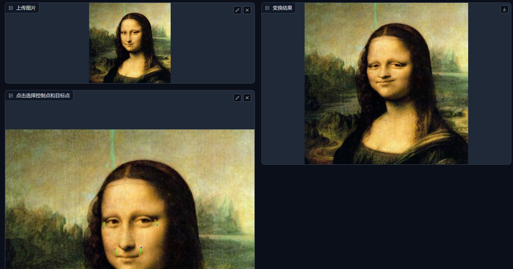

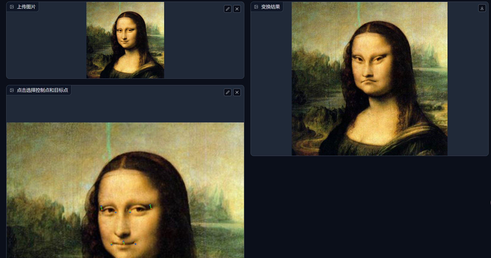

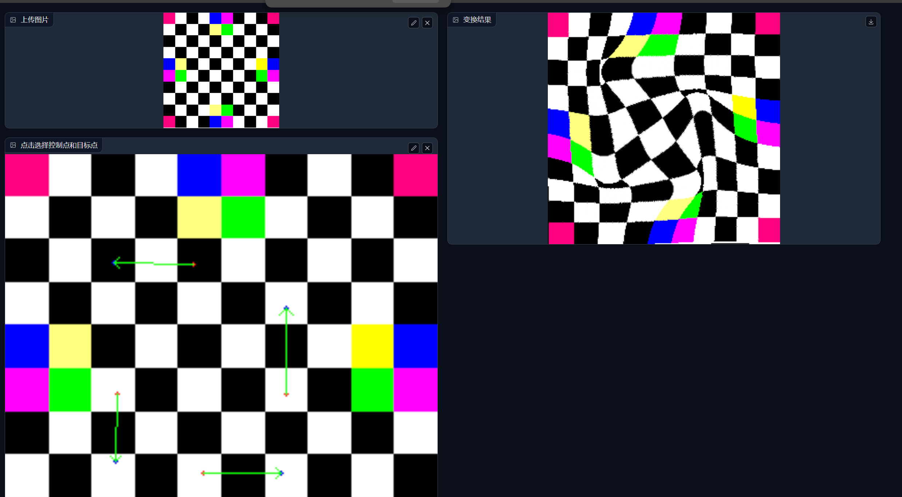

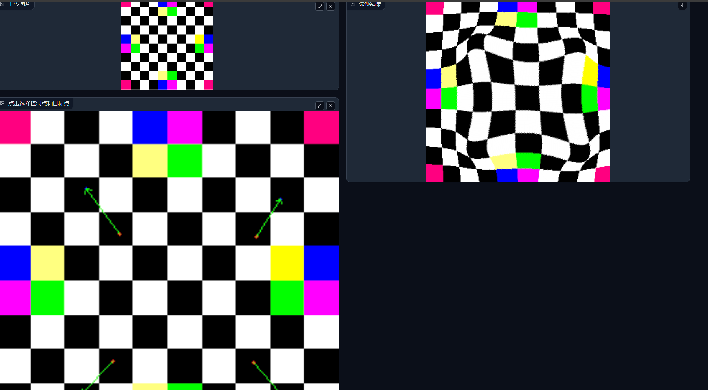

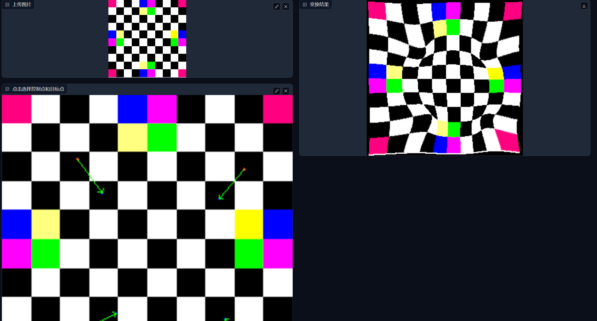


## Acknowledgement

> 📋 Thanks for the algorithms proposed by [Image Warping by Radial Basis Functions](https://www.sci.utah.edu/~gerig/CS6640-F2010/Project3/Arad-1995.pdf)
