# Assignment 2 - DIP with PyTorch

数字图像处理第二次作业：

1. 泊松融合
2. 使用深度学习模型完成Pix2Pix

### Resources:

- [Assignment Slides](https://rec.ustc.edu.cn/share/705bfa50-6e53-11ef-b955-bb76c0fede49)  
- [Paper: Poisson Image Editing](https://www.cs.jhu.edu/~misha/Fall07/Papers/Perez03.pdf)
- [Paper: Image-to-Image Translation with Conditional Adversarial Nets](https://phillipi.github.io/pix2pix/)
- [Paper: Fully Convolutional Networks for Semantic Segmentation](https://arxiv.org/abs/1411.4038)
- [PyTorch Installation & Docs](https://pytorch.org/)


### Requirements:

To install requirements:

```cmd
pip install -r requirements.txt
```
还需要根据电脑配置自行安装`pytorch`

## Running

To run Poisson Image Editing, run:

```cmd
python run_blending_gradio.py
```

To run Pix2Pix, run:

```cmd
python train.py
```


### 1. Poisson Image Editing with PyTorch.

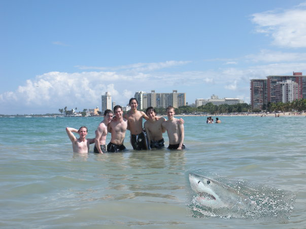

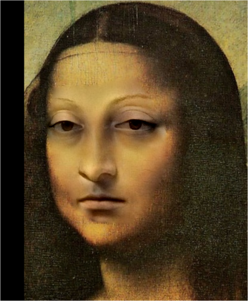


### 2. Pix2Pix implementation.
- 训练集结果：

  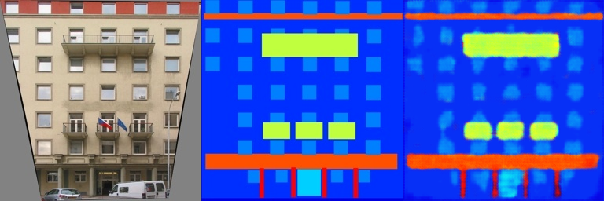

  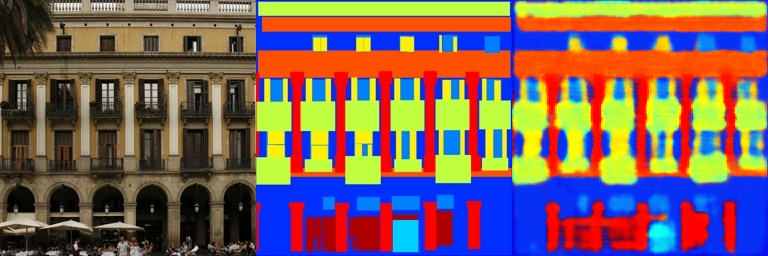

  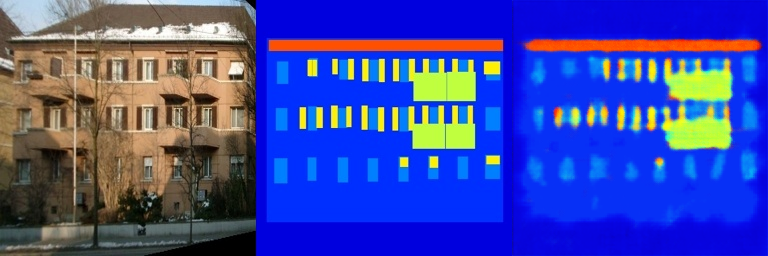

  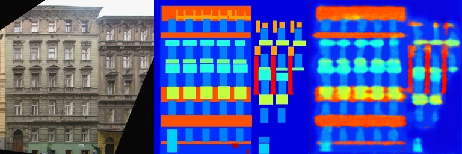

  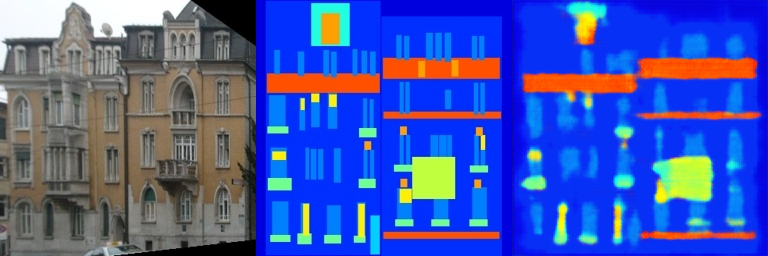
  
- 测试集结果：

  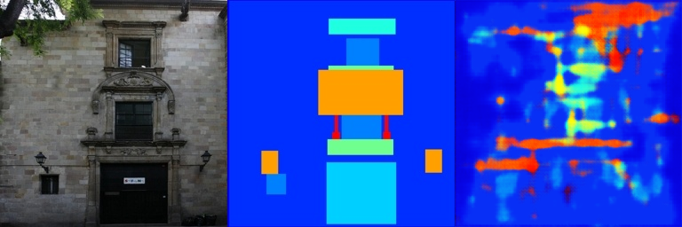

  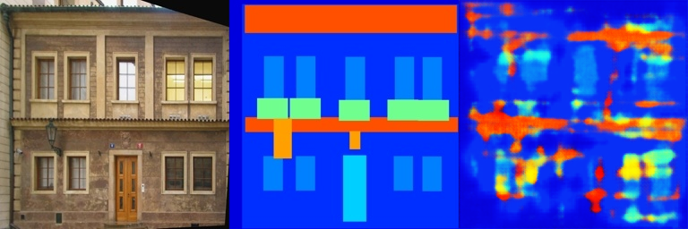

  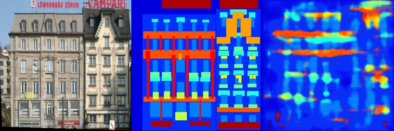

  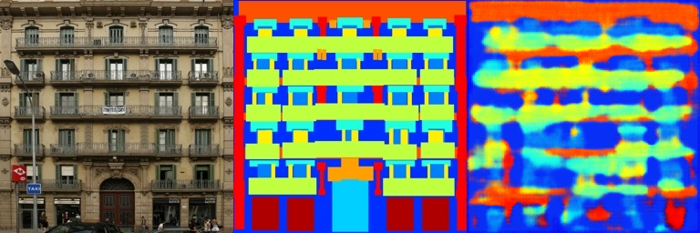

  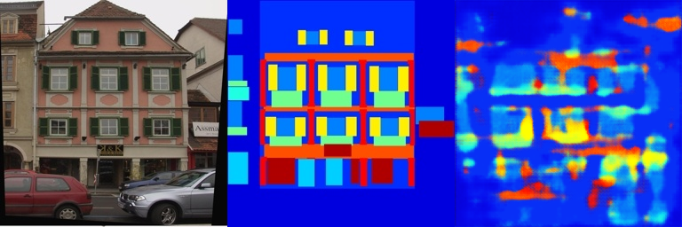
